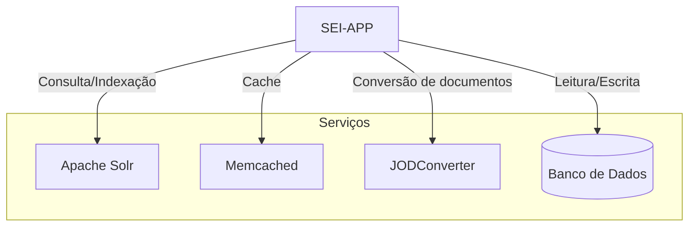

# sei5-projetos

Este repositório contem a infraestrutura do SEI (Sistema Eletrônico de Informações) empacotada em containers Docker com suporte para os bancos Oracle e PostgreSql

```mermaid
graph TD;
    PHP[SEI-APP] -->|Consulta/Indexação| Solr[Apache Solr]
    PHP -->|Cache| Memcached[Memcached]
    PHP -->|Conversão de documentos| JOD[JODConverter]
    PHP -->|Leitura/Escrita| DB[(Banco de Dados)]
    
    subgraph Serviços
        Solr
        Memcached
        JOD
        DB
    end
```