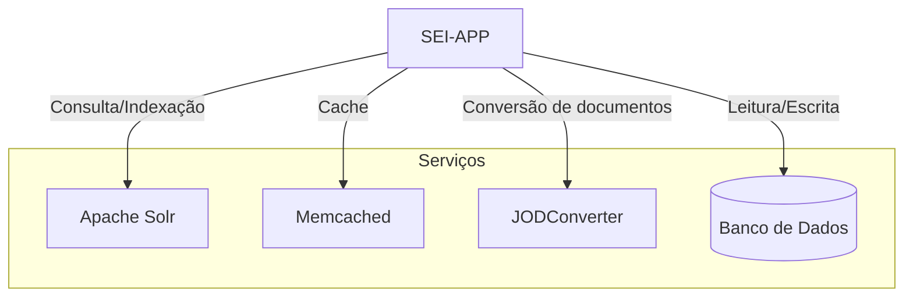

# sei5-projetos

Este repositório contém a infraestrutura do **SEI (Sistema Eletrônico de Informações)** empacotada em **containers Docker** com suporte para os bancos **Oracle** e **PostgreSQL**.

## 📌 Visão Geral
O SEI é um sistema de gestão de processos eletrônicos utilizado por diversas instituições para digitalização e automação de fluxos de trabalho. Este projeto fornece uma infraestrutura Dockerizada para facilitar sua implantação e manutenção.

## 📦 Arquitetura dos Serviços

## Componentes

### SEI-APP
- Container principal que executa o **SEI e SIP**.
- Responsável por processar as requisições dos usuários.
- Interage com os serviços auxiliares para otimizar desempenho e funcionalidades.

### Apache Solr
- Utilizado para **indexação e busca** de documentos e processos.
- Melhora o desempenho das pesquisas dentro do SEI.

### Memcached
- Serviço de **cache** para melhorar a performance do SEI.
- Reduz o tempo de resposta armazenando dados frequentemente acessados.

### JODConverter (JOD)
- Responsável pela **conversão de documentos**.
- Converte arquivos para formatos compatíveis dentro do SEI.

### Banco de Dados (PostgreSQL ou Oracle)
- Armazena todos os **dados e metadados** do SEI.
- Suporte para **PostgreSQL** e **Oracle**, conforme necessidade da instituição.
