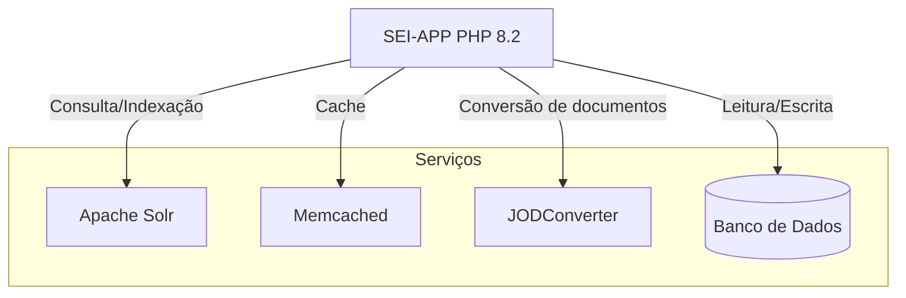

# SEI-APP

Este repositório contém a aplicação SEI (Sistema Eletrônico de Informações) empacotada em um contêiner Docker baseado em Alpine Linux 3.21, com suporte para os bancos de dados Oracle e PostgreSQL.

## Tecnologias Utilizadas

- **Base da imagem**: Alpine Linux 3.21
- **Linguagem**: PHP 8.2
- **Servidor Web**: Apache2
- **Bancos de Dados Suportados**: Oracle e PostgreSQL
- **Fontes do SEI**: `[registry]/sei-fontes:5.0.0.xyz`

## Expondo a Aplicação

A aplicação expõe a porta **80** para acesso externo
